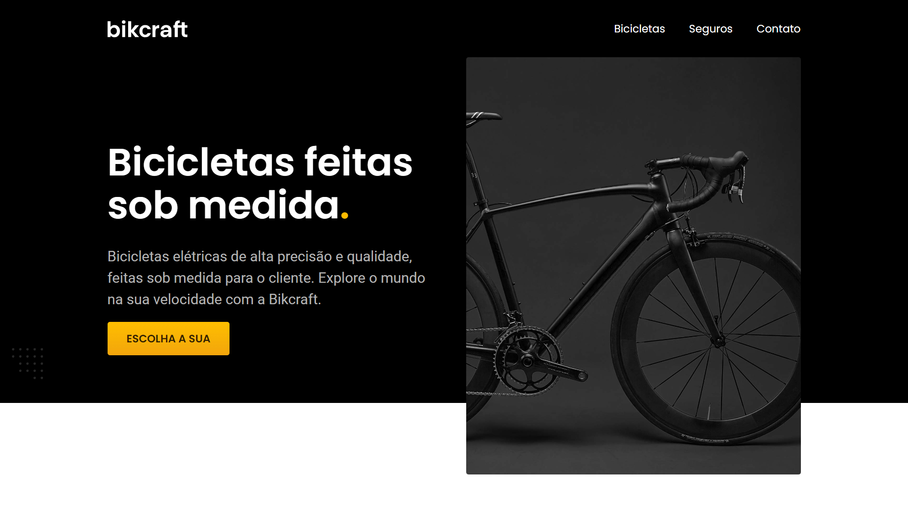
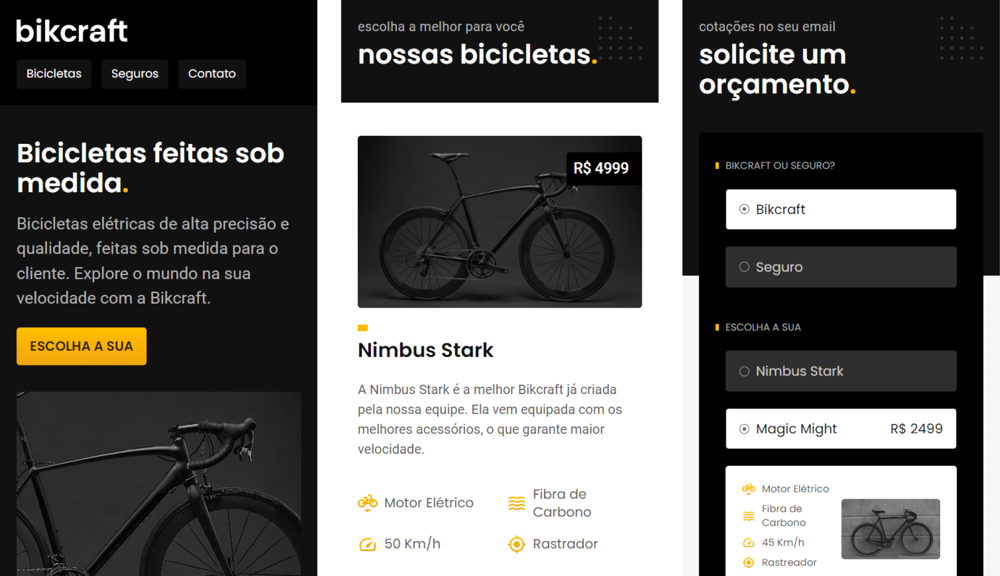

# Bikcraft 🚴

Acesse o projeto clicando [aqui](https://filipehibrael.github.io/bikcraft/)

## 📱 Layout Mobile

## 📖 Sobre

Aplicação que simula uma loja online de bicicletas. O site possui ao todo sete páginas onde eu pude trabalhar principalmente meu aprendizado em HTML e CSS, além de diversos conceitos de web design, como a escolha de tipografia, paleta de cores, imagens, espaçamentos e outros elementos que contribuem para uma experiência visualmente atraente. Projeto desenvolvido durante o curso de HTML e CSS da plataforma [Origamid](https://www.origamid.com/)

## 🛠️ Ferramentas Utilizadas

- HTML5
- CSS3
- JavaScript